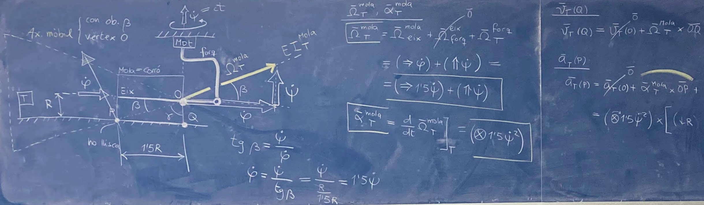

<!-- Markdown comments are html ones -->

# Problemes G30 i G50 #

Mecànica: Curs 2026-27 Q1 (Tardor)

[Grau en Enginyeria en Tecnologies Industrials](https://etseib.upc.edu/ca/estudis/graus/fitxa-geti)  
[Dep. d'Enginyeria Mecànica](https://em.upc.edu/ca), [UPC-BarcelonaTech](http://www.upc.edu)

Benvinguts! En aquesta pàgina hi trobareu material relatiu als grups G30 i G50 de problemes de Mecànica: els exercicis que farem, les seves solucions, un FAQ, el formulari oficial, abreviacions que utilitzo, o transparències de classe quan calguin, entre d'altres. És ESSENCIAL que treballeu els exercicis per la vostra banda abans de consultar les solucions aquí penjades.
 

[Full informatiu](full_informatiu.pdf) + [Guia de bones pràctiques](bones_practiques.pdf)

<!-- 
Enunciats per dur a classe: [Preparcials](https://atenea.upc.edu/pluginfile.php/6869470/mod_resource/content/27/2025-26%20QP%20Material%20pre-parcials.pdf) - Postparcials
-->

## Índex

[Wikimec](https://mec.etseib.upc.edu) - [FAQ](faqp.html) - [Formulari](formulari.pdf) - [Abreviacions](abreviacions.pdf) 

<!-- 
- [Catàleg forces](cataleg-forces.pdf)
-->

| Preparcials | Postparcials |
| ----------  | ------------ |
| [2P: Bases i derivació analítica](#2p-bases-i-derivació-analítica) | 8P: Molles i amortidors + Enllaç PS |
| 3P: Derivació + Angles d'Euler  | 9P: Oscil·lacions i punts d'equilibri    |
| 4P: Composició de moviments | 10P: Geometria de masses |
| 5P: CSR 3D        | 11P: Teoremes vectorials I |
| 6P: CSR 2D + Cinemàtica de vehicles                    | 12P: Teoremes vectorials II |
| 7P: Exercicis globals de cinemàtica | 14P: Teoremes vectorials III |
| Examen Parcial: 27 octubre, 11:00   | 15P: Teoremes vectorials IV |

Aclariment: Tal i com hem numerat les sessions (vegeu full informatiu) aquest quadrimestre no hi haurà sessions 1P ni 13P, però el contingut del curs és anàleg al de cursos anteriors.

## Recomanacions

Abans de cada sessió:

1. Estudieu bé la teoria impartida aquella setmana.
2. Llegiu amb cura els enunciats, entenent com es mou el sistema.
2. Intenteu resoldre les parts que pugueu.

<!-- 
Durant la sessió:

1. Preneu apunts breus.
2. Pregunteu dubtes que us sorgeixin. 
-->

Després de la sessió: 
1. Refeu els exercicis vosaltres, entenent-los a fons.
2. Resoleu els apartats que s'hagin deixat com a deures.
3. Contrasteu les vostres solucions amb les penjades.
4. Feu el treball autònom que es proposa a Atenea.

## 2P: Bases i derivació analítica

[Solucions 2P](problemes/2P_sols.pdf)

<!-- 

## 3P: Derivació + angles d'Euler

[Solucions 3P](problemes/3P_sols.pdf) - Actualitzat 26 FEB 21:09

[Exercicis extra sobre angles d'Euler](problemes/3P_extra.pdf) - Actualitzat 4 MAR 15:05

Vídeos:
* [Moviment del bloc sobre semicilindre](https://youtu.be/tAMvFMHxPk0).
* [Pilotatge amb línia de control](https://www.youtube.com/watch?v=wZavLFRsMHg&t=179s).
* [Angles d'Euler al giroscopi](https://www.youtube.com/watch?v=ON0VWB34Dso).

## 3P: Composició de moviments

[Solucions 3P](problemes/3P_sols.pdf) - Actualitzat 9 MAR 18:18

[Diapositives de 3P](problemes/3P_slides.pdf).

[Exercicis extra de composició de moviments](problemes/3P_extra.pdf). Actualitzat 29 MAR 21:10

## 4P: Cinemàtica del sòlid rígid 3D

[Solucions 4P](problemes/4P_sols.pdf) - Actualitzat 12 MAR 21:05

[Exercicis extra de CSR 3D](problemes/4P_extra.pdf).

## 5P: CSR 2D + cinemàtica de vehicles

[Solucions 5P](problemes/5P_sols.pdf) - Actualitzat 24 MAR 13:30

[Exercicis extra de CSR 2D i cinemàtica de vehicles](problemes/5P_extra.pdf).

Animacions: 

* [Disc rodolant](https://www.geogebra.org/classic/tkb7md6s): "Play" a baix a l'esquerra!
* [Barra vermella que no gira](https://www.geogebra.org/classic/qfk7haxt): "Play" a baix a l'esquerra! S'ha suposat una barra infinita i que no hi ha col·lisions entre sòlids.
* [Bicicleta](https://www.geogebra.org/material/iframe/id/fyx5j2wy/width/850/height/500/border/888888/sfsb/true/smb/false/stb/false/stbh/false/ai/false/asb/false/sri/false/rc/false/ld/false/sdz/false/ctl/false): Desplaceu H per a veure la trajectòria del pedal.

## 6P: Exercicis globals de cinemàtica

[Solucions 6P](problemes/6P_sols.pdf) - Actualitzat 24 MAR 17:54.

[Exercicis extra de cinemàtica](problemes/6P_extra.pdf).

## 7P: Molles i amortidors, i enllaç partícula-superfície

Transparències de la teoria [amb notes explicatives](problemes/7P_slides_with_notes.pdf) i [sense](problemes/7P_slides.pdf). Actualitzat 16 ABR 21:35.

[Lliçó completa, amb resolucions dels exercicis](problemes/7P_sols.pdf). Actualitzat 16 ABR 21:35.

Teoria corresponent a Wikimec: Seccions D2.4, D2.5, D2.7 i D2.8.

[Exercicis extra de molles i amortidors](problemes/7P_extra.pdf).

## 8P: Oscil·lacions i punts d'equilibri

[Solucions 8P](problemes/8P_sols.pdf) - Actualitzat 28 ABR 14:25.

## 9P: Geometria de masses

[Solucions 9P](problemes/9P_sols.pdf) - Penjat 28 ABR 14:45.

[Transparències de classe](problemes/9P_slides.pdf) - Actualitzades 3 MAIG 17:34. Crec que ja són les definitives!

## 10P: Teoremes vectorials I

[Solucions 10P](problemes/10P_sols.pdf) - Actualitzat 6 MAIG 23:30

[Transparències de classe amb comentaris](problemes/10P_slides.pdf) - Actualitzat 7 MAIG 16:20

## 11P: Teoremes vectorials II

[Solucions 11P](problemes/11P_sols.pdf) - Actualitzat 14 MAIG 12:00

[Transparències de suport](problemes/11P_slides.pdf) - Actualitzat 13 MAIG 23:10

## 12P: Teoremes vectorials III

[Enunciats](problemes/12P_enunciats.pdf) + [Solucions 12P](problemes/12P_sols.pdf) - Actualitzat 21 MAIG 19:23.

[Transparències de suport](problemes/12P_slides.pdf) - Actualitzat 21 MAIG 19:23. Vegeu versions comentades de les primeres transparències a [12P_sols.pdf](problemes/12P_sols.pdf).

## 13P: Teoremes vectorials IV

[Solucions 13P](problemes/13P_sols.pdf) - Actualitzat 27 Maig 23:16.

[Transparències de classe](problemes/13P_slides.pdf) - Actualitzat 28 MAIG 22:00.

-->

## Bibliografia

Wikimec:

* [https://mec.etseib.upc.edu](https://mec.etseib.upc.edu)

<!-- 
* [https://mec.etseib.upc.edu/en](https://mec.etseib.upc.edu/en) (Anglès)
-->

Exercicis resolts:

* Tots els de la [Wikimec](https://mec.etseib.upc.edu) i del treball autònom d'Atenea.

* J. Agulló i Batlle, ["Mecànica: resolucions de qüestions i problemes"](https://drive.google.com/file/d/1Pnyjt3wqPv5TnCYW_k2xzqRdjOkGmIhm/view). Publicacions OK Punt, 2005.

Llibres de referència:

* J. Agulló i Batlle, A. Barjau Condomines, ["Rigid body kinematics"](https://discovery.upc.edu/discovery/fulldisplay?docid=alma991001807209706711&context=L&vid=34CSUC_UPC:VU1&lang=ca&search_scope=MyInst_and_CI&adaptor=Local%20Search%20Engine&tab=Everything&query=any,contains,rigid%20body%20kinematics), Cambridge University Press, 2020.  
* J. Agulló i Batlle, A. Barjau Condomines, ["Rigid body Dynamics"](https://discovery.upc.edu/discovery/fulldisplay?docid=alma991005056379406711&context=L&vid=34CSUC_UPC:VU1&lang=ca&search_scope=MyInst_and_CI&adaptor=Local%20Search%20Engine&tab=Everything&query=any,contains,rigid%20body%20dynamics&offset=0), Cambridge University Press, 2022.

* J. Agulló i Batlle, ["Mecànica de la partícula i del sòlid rígid"](https://drive.google.com/file/d/1N22VNGK_2FQnVZzZuqxPn2JlbAflULm6/view), Publicacions OK punt, 2002.  

## Enllaços
* [Wikimec](https://mec.etseib.upc.edu)
* [Formulari](formulari.pdf)
* [Full informatiu](full_informatiu.pdf)
* [Decàleg per als exàmens](decaleg.pdf)
* [Horaris](horaris.pdf)
* [Calendari ETSEIB 2026-27](calendari.pdf)
* [FAQ](faqp.html)
* Edicions anteriors: [[2025-26 Q2](Arxiu/2025-26-Q2/index.md)] - [[2025-26 Q1](Arxiu/2025-26-Q1/index.md)] - [[2024-25 Q2](Arxiu/2024-25-Q2/index.md)]

 
 
 
 
 
 
 
 
 
 
 
 
 
 
 
 
 
 

